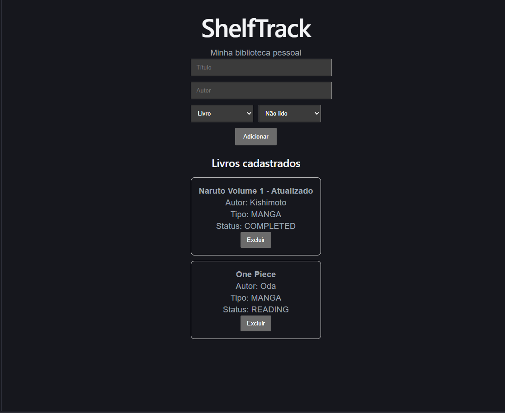

# 📚 ShelfTrack


Aplicação fullstack para gerenciamento de biblioteca pessoal (livros e mangás).

---

## 🚀 Tecnologias utilizadas

### Backend
- Java 17
- Spring Boot
- Spring Data JPA
- PostgreSQL

### Frontend
- React
- Vite
- Axios

---

## ⚙️ Funcionalidades

- 📌 Cadastro de livros e mangás
- 📖 Controle de status (Não lido, Lendo, Concluído)
- 🗑️ Exclusão de itens
- 📋 Listagem de biblioteca

---

## 🖥️ Demonstração



---

## 📦 Como rodar o projeto

### 🔹 Backend

```bash
cd shelftrack
./mvnw spring-boot:run